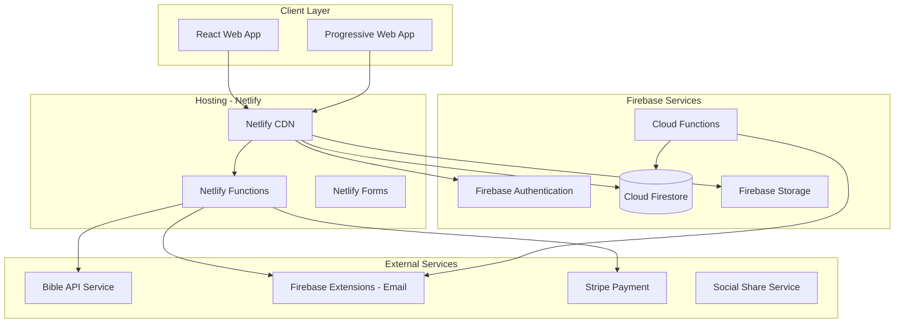
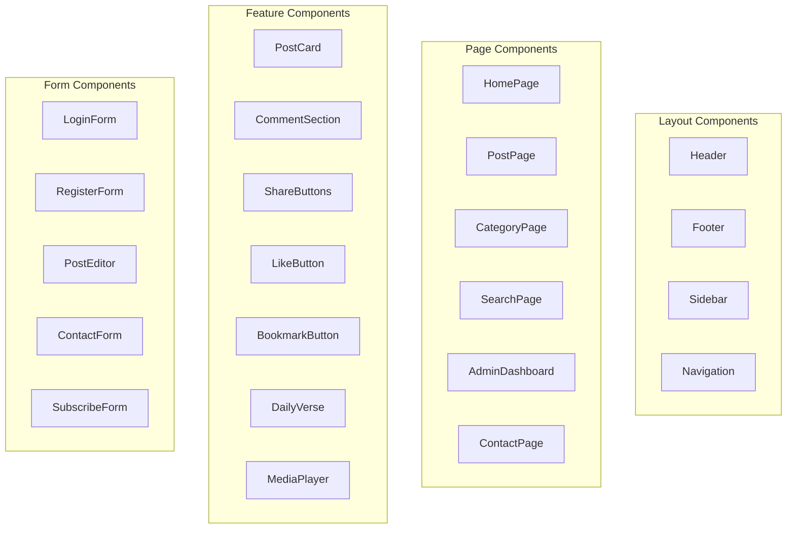

# Design Document: Walkthrough Bible Series

## Overview

Walkthrough Bible Series is a full-stack responsive web application built as a Christian content platform. The system follows a modern serverless JAMstack architecture with a React frontend hosted on Netlify, Firebase/Firestore for backend services and database, and Firebase Storage for media. The platform supports multi-format content (text, video, audio), social engagement features, role-based access control, and integrations with external services for Bible verses, social sharing, and payment processing.

## Architecture



### Technology Stack

**Frontend:**
- React 18 with TypeScript
- Tailwind CSS for styling
- React Router for navigation
- React Query for data fetching and caching
- Zustand for state management
- React Hook Form for form handling
- Framer Motion for animations

**Backend & Database (Firebase):**
- Firebase Authentication (Email/Password, Google, Social logins)
- Cloud Firestore (NoSQL database)
- Firebase Storage (Media files - video, audio, images)
- Cloud Functions (Serverless backend logic)
- Firebase Security Rules (Access control)

**Hosting & Deployment:**
- Netlify (Static site hosting with CDN)
- Netlify Functions (Serverless API endpoints)
- Netlify Forms (Contact form handling)
- Automatic deployments from Git

**External Services:**
- Firebase Storage for media storage
- Firebase Extensions for email (Trigger Email)
- Bible API for verse lookups
- Stripe for donations

## Components and Interfaces

### Frontend Components



### Firebase Service Functions

Instead of traditional REST API endpoints, the application uses Firebase SDK directly from the client with Netlify Functions for server-side operations that require secrets or complex logic.

```typescript
// Firebase Client SDK Services (src/services/)

// Auth Service - src/services/auth.ts
import { auth } from '../config/firebase';
import { 
  signInWithEmailAndPassword, 
  createUserWithEmailAndPassword,
  signOut,
  sendPasswordResetEmail,
  GoogleAuthProvider,
  signInWithPopup
} from 'firebase/auth';

export const authService = {
  login: (email: string, password: string) => signInWithEmailAndPassword(auth, email, password),
  register: (email: string, password: string) => createUserWithEmailAndPassword(auth, email, password),
  logout: () => signOut(auth),
  resetPassword: (email: string) => sendPasswordResetEmail(auth, email),
  loginWithGoogle: () => signInWithPopup(auth, new GoogleAuthProvider()),
};

// Posts Service - src/services/posts.ts
import { db, storage } from '../config/firebase';
import { 
  collection, doc, getDoc, getDocs, addDoc, updateDoc, deleteDoc,
  query, where, orderBy, limit, startAfter, Timestamp
} from 'firebase/firestore';
import { ref, uploadBytes, getDownloadURL } from 'firebase/storage';

export const postsService = {
  // Get all published posts (paginated)
  getPosts: (pageSize: number, lastDoc?: any) => {
    let q = query(
      collection(db, 'posts'),
      where('status', '==', 'published'),
      orderBy('publishedAt', 'desc'),
      limit(pageSize)
    );
    if (lastDoc) q = query(q, startAfter(lastDoc));
    return getDocs(q);
  },
  
  // Get single post by slug
  getPostBySlug: (slug: string) => {
    const q = query(collection(db, 'posts'), where('slug', '==', slug));
    return getDocs(q);
  },
  
  // Get posts by category
  getPostsByCategory: (categoryId: string, pageSize: number) => {
    return getDocs(query(
      collection(db, 'posts'),
      where('categoryId', '==', categoryId),
      where('status', '==', 'published'),
      orderBy('publishedAt', 'desc'),
      limit(pageSize)
    ));
  },
  
  // Get trending posts
  getTrendingPosts: (count: number) => {
    return getDocs(query(
      collection(db, 'posts'),
      where('status', '==', 'published'),
      orderBy('views', 'desc'),
      limit(count)
    ));
  },
  
  // Create post
  createPost: (postData: Partial<PostDocument>) => {
    return addDoc(collection(db, 'posts'), {
      ...postData,
      createdAt: Timestamp.now(),
      updatedAt: Timestamp.now()
    });
  },
  
  // Update post
  updatePost: (postId: string, postData: Partial<PostDocument>) => {
    return updateDoc(doc(db, 'posts', postId), {
      ...postData,
      updatedAt: Timestamp.now()
    });
  },
  
  // Delete post
  deletePost: (postId: string) => deleteDoc(doc(db, 'posts', postId)),
  
  // Upload media
  uploadMedia: async (file: File, path: string) => {
    const storageRef = ref(storage, `media/${path}/${file.name}`);
    await uploadBytes(storageRef, file);
    return getDownloadURL(storageRef);
  },
  
  // Increment view count
  incrementViews: (postId: string) => {
    return updateDoc(doc(db, 'posts', postId), {
      views: increment(1)
    });
  },
  
  // Like/unlike post
  toggleLike: async (postId: string, visitorId: string) => {
    const postRef = doc(db, 'posts', postId);
    const postSnap = await getDoc(postRef);
    const likedBy = postSnap.data()?.likedBy || [];
    
    if (likedBy.includes(visitorId)) {
      return updateDoc(postRef, {
        likes: increment(-1),
        likedBy: arrayRemove(visitorId)
      });
    } else {
      return updateDoc(postRef, {
        likes: increment(1),
        likedBy: arrayUnion(visitorId)
      });
    }
  }
};

// Comments Service - src/services/comments.ts
export const commentsService = {
  getComments: (postId: string) => {
    return getDocs(query(
      collection(db, 'comments'),
      where('postId', '==', postId),
      where('status', '==', 'approved'),
      orderBy('createdAt', 'asc')
    ));
  },
  
  addComment: (commentData: Partial<CommentDocument>) => {
    return addDoc(collection(db, 'comments'), {
      ...commentData,
      status: 'pending',
      createdAt: Timestamp.now()
    });
  },
  
  approveComment: (commentId: string) => {
    return updateDoc(doc(db, 'comments', commentId), { status: 'approved' });
  },
  
  deleteComment: (commentId: string) => deleteDoc(doc(db, 'comments', commentId))
};

// Categories Service - src/services/categories.ts
export const categoriesService = {
  getCategories: () => getDocs(query(collection(db, 'categories'), orderBy('order', 'asc'))),
  createCategory: (data: Partial<CategoryDocument>) => addDoc(collection(db, 'categories'), data),
  updateCategory: (id: string, data: Partial<CategoryDocument>) => updateDoc(doc(db, 'categories', id), data),
  deleteCategory: (id: string) => deleteDoc(doc(db, 'categories', id))
};

// Events Service - src/services/events.ts
export const eventsService = {
  getUpcomingEvents: () => {
    return getDocs(query(
      collection(db, 'events'),
      where('date', '>=', Timestamp.now()),
      orderBy('date', 'asc')
    ));
  },
  createEvent: (data: Partial<EventDocument>) => addDoc(collection(db, 'events'), data),
  updateEvent: (id: string, data: Partial<EventDocument>) => updateDoc(doc(db, 'events', id), data),
  deleteEvent: (id: string) => deleteDoc(doc(db, 'events', id))
};

// Testimonies Service - src/services/testimonies.ts
export const testimoniesService = {
  getApprovedTestimonies: () => {
    return getDocs(query(
      collection(db, 'testimonies'),
      where('status', '==', 'approved'),
      orderBy('createdAt', 'desc')
    ));
  },
  submitTestimony: (data: Partial<TestimonyDocument>) => {
    return addDoc(collection(db, 'testimonies'), {
      ...data,
      status: 'pending',
      createdAt: Timestamp.now()
    });
  },
  approveTestimony: (id: string) => updateDoc(doc(db, 'testimonies', id), { status: 'approved' })
};

// Subscribers Service - src/services/subscribers.ts
export const subscribersService = {
  subscribe: (email: string, name?: string) => {
    return addDoc(collection(db, 'subscribers'), {
      email,
      name,
      isConfirmed: false,
      subscribedAt: Timestamp.now()
    });
  },
  unsubscribe: async (email: string) => {
    const q = query(collection(db, 'subscribers'), where('email', '==', email));
    const snapshot = await getDocs(q);
    if (!snapshot.empty) {
      return updateDoc(snapshot.docs[0].ref, { unsubscribedAt: Timestamp.now() });
    }
  }
};

// Contact Service - src/services/contact.ts
export const contactService = {
  submitMessage: (data: Partial<ContactMessageDocument>) => {
    return addDoc(collection(db, 'contactMessages'), {
      ...data,
      isRead: false,
      createdAt: Timestamp.now()
    });
  },
  getSiteSettings: () => getDoc(doc(db, 'siteSettings', 'main'))
};

// Prayer Requests Service - src/services/prayerRequests.ts
export const prayerRequestsService = {
  submitRequest: (data: Partial<PrayerRequestDocument>) => {
    return addDoc(collection(db, 'prayerRequests'), {
      ...data,
      createdAt: Timestamp.now()
    });
  }
};
```

### Netlify Functions (for server-side operations)

```typescript
// netlify/functions/bible-verse.ts - Get Bible verses from external API
import { Handler } from '@netlify/functions';

export const handler: Handler = async (event) => {
  const { reference, translation = 'KJV' } = event.queryStringParameters || {};
  
  const response = await fetch(
    `https://bible-api.com/${encodeURIComponent(reference)}?translation=${translation}`
  );
  const data = await response.json();
  
  return {
    statusCode: 200,
    body: JSON.stringify(data)
  };
};

// netlify/functions/send-email.ts - Send emails via SendGrid/Firebase
import { Handler } from '@netlify/functions';
import sgMail from '@sendgrid/mail';

sgMail.setApiKey(process.env.SENDGRID_API_KEY!);

export const handler: Handler = async (event) => {
  const { to, subject, html } = JSON.parse(event.body || '{}');
  
  await sgMail.send({
    to,
    from: process.env.FROM_EMAIL!,
    subject,
    html
  });
  
  return { statusCode: 200, body: JSON.stringify({ success: true }) };
};

// netlify/functions/create-payment.ts - Stripe payment intent
import { Handler } from '@netlify/functions';
import Stripe from 'stripe';

const stripe = new Stripe(process.env.STRIPE_SECRET_KEY!);

export const handler: Handler = async (event) => {
  const { amount } = JSON.parse(event.body || '{}');
  
  const paymentIntent = await stripe.paymentIntents.create({
    amount: amount * 100, // Convert to cents
    currency: 'usd',
    metadata: { purpose: 'donation' }
  });
  
  return {
    statusCode: 200,
    body: JSON.stringify({ clientSecret: paymentIntent.client_secret })
  };
};

// netlify/functions/search-posts.ts - Full-text search with Algolia (optional)
import { Handler } from '@netlify/functions';
import algoliasearch from 'algoliasearch';

const client = algoliasearch(process.env.ALGOLIA_APP_ID!, process.env.ALGOLIA_API_KEY!);
const index = client.initIndex('posts');

export const handler: Handler = async (event) => {
  const { query, filters } = event.queryStringParameters || {};
  
  const results = await index.search(query || '', {
    filters: filters || 'status:published'
  });
  
  return {
    statusCode: 200,
    body: JSON.stringify(results)
  };
};
```

### Component Interfaces

```typescript
// User Types
interface User {
  id: string;
  email: string;
  name: string;
  role: 'admin' | 'collaborator' | 'reader';
  avatar?: string;
  createdAt: Date;
  updatedAt: Date;
}

// Post Types
interface Post {
  id: string;
  title: string;
  slug: string;
  content: string;
  excerpt: string;
  contentType: 'text' | 'video' | 'audio';
  mediaUrl?: string;
  thumbnailUrl?: string;
  author: User;
  category: Category;
  tags: string[];
  status: 'draft' | 'published' | 'archived';
  likes: number;
  views: number;
  readingTime?: number;
  duration?: number;
  publishedAt?: Date;
  createdAt: Date;
  updatedAt: Date;
}

// Comment Types
interface Comment {
  id: string;
  postId: string;
  authorName: string;
  authorEmail: string;
  content: string;
  status: 'pending' | 'approved' | 'rejected';
  createdAt: Date;
}

// Category Types
interface Category {
  id: string;
  name: string;
  slug: string;
  description?: string;
  icon?: string;
  postCount: number;
}

// Event Types
interface Event {
  id: string;
  title: string;
  description: string;
  date: Date;
  endDate?: Date;
  location?: string;
  isOnline: boolean;
  link?: string;
  createdAt: Date;
}

// Testimony Types
interface Testimony {
  id: string;
  authorName: string;
  content: string;
  status: 'pending' | 'approved' | 'rejected';
  createdAt: Date;
}

// Contact Info Types
interface ContactInfo {
  whatsapp: string;
  phone: string;
  email: string;
  address?: string;
  socialLinks: {
    facebook?: string;
    youtube?: string;
    twitter?: string;
    instagram?: string;
    tiktok?: string;
  };
}

// Search Types
interface SearchParams {
  query: string;
  contentType?: 'text' | 'video' | 'audio';
  category?: string;
  dateFrom?: Date;
  dateTo?: Date;
  author?: string;
  page?: number;
  limit?: number;
}

interface SearchResult {
  posts: Post[];
  total: number;
  page: number;
  totalPages: number;
  suggestions?: string[];
}
```

## Data Models

### Firestore Collections Structure

```typescript
// Collection: users
interface UserDocument {
  uid: string;                    // Firebase Auth UID
  email: string;
  displayName: string;
  role: 'admin' | 'collaborator' | 'reader';
  photoURL?: string;
  permissions: {
    canPublish: boolean;
    canEditOwnPosts: boolean;
    canEditAllPosts: boolean;
    canManageUsers: boolean;
  };
  isActive: boolean;
  lastLogin: Timestamp;
  createdAt: Timestamp;
  updatedAt: Timestamp;
}

// Collection: posts
interface PostDocument {
  id: string;
  title: string;
  slug: string;
  content: string;
  excerpt: string;
  contentType: 'text' | 'video' | 'audio';
  mediaUrl?: string;
  thumbnailUrl?: string;
  authorId: string;              // Reference to users collection
  authorName: string;            // Denormalized for queries
  categoryId: string;            // Reference to categories collection
  categoryName: string;          // Denormalized for queries
  tags: string[];
  status: 'draft' | 'published' | 'archived';
  likes: number;
  likedBy: string[];             // Array of user IDs or fingerprints
  views: number;
  readingTime?: number;
  duration?: number;
  featuredOrder?: number;
  publishedAt?: Timestamp;
  createdAt: Timestamp;
  updatedAt: Timestamp;
}

// Collection: comments
interface CommentDocument {
  id: string;
  postId: string;
  authorName: string;
  authorEmail: string;
  content: string;
  status: 'pending' | 'approved' | 'rejected';
  createdAt: Timestamp;
}

// Collection: categories
interface CategoryDocument {
  id: string;
  name: string;
  slug: string;
  description?: string;
  icon?: string;
  order: number;
  postCount: number;
  createdAt: Timestamp;
}

// Collection: events
interface EventDocument {
  id: string;
  title: string;
  description: string;
  date: Timestamp;
  endDate?: Timestamp;
  location?: string;
  isOnline: boolean;
  link?: string;
  imageUrl?: string;
  createdAt: Timestamp;
}

// Collection: testimonies
interface TestimonyDocument {
  id: string;
  authorName: string;
  authorEmail?: string;
  content: string;
  status: 'pending' | 'approved' | 'rejected';
  createdAt: Timestamp;
}

// Collection: prayerRequests
interface PrayerRequestDocument {
  id: string;
  name: string;
  email?: string;
  request: string;
  isPrivate: boolean;
  createdAt: Timestamp;
}

// Collection: subscribers
interface SubscriberDocument {
  id: string;
  email: string;
  name?: string;
  isConfirmed: boolean;
  confirmToken?: string;
  subscribedAt: Timestamp;
  unsubscribedAt?: Timestamp;
}

// Collection: contactMessages
interface ContactMessageDocument {
  id: string;
  name: string;
  email: string;
  subject?: string;
  message: string;
  isRead: boolean;
  createdAt: Timestamp;
}

// Collection: siteSettings (single document)
interface SiteSettingsDocument {
  siteName: string;
  tagline?: string;
  description?: string;
  logoUrl?: string;
  faviconUrl?: string;
  contactInfo: {
    whatsapp?: string;
    phone?: string;
    email?: string;
    address?: string;
  };
  socialLinks: {
    facebook?: string;
    youtube?: string;
    twitter?: string;
    instagram?: string;
    tiktok?: string;
  };
  donationSettings: {
    enabled: boolean;
    stripePublicKey?: string;
    goalAmount?: number;
    currentAmount?: number;
  };
  liveStreamUrl?: string;
  isLiveNow: boolean;
}

// Collection: bookmarks (subcollection under users or separate)
interface BookmarkDocument {
visitorId: string;              // For non-authenticated users (fingerprint)
  userId?: string;                // For authenticated users
  postId: string;
  createdAt: Timestamp;
}
```

### Firestore Security Rules

```javascript
rules_version = '2';
service cloud.firestore {
  match /databases/{database}/documents {
    // Helper functions
    function isAuthenticated() {
      return request.auth != null;
    }
    
    function isAdmin() {
      return isAuthenticated() && 
        get(/databases/$(database)/documents/users/$(request.auth.uid)).data.role == 'admin';
    }
    
    function isCollaborator() {
      return isAuthenticated() && 
        get(/databases/$(database)/documents/users/$(request.auth.uid)).data.role in ['admin', 'collaborator'];
    }
    
    function isOwner(userId) {
      return isAuthenticated() && request.auth.uid == userId;
    }
    
    // Users collection
    match /users/{userId} {
      allow read: if isAuthenticated();
      allow create: if isAdmin();
      allow update: if isOwner(userId) || isAdmin();
      allow delete: if isAdmin();
    }
    
    // Posts collection
    match /posts/{postId} {
      allow read: if resource.data.status == 'published' || isCollaborator();
      allow create: if isCollaborator();
      allow update: if isAdmin() || 
        (isCollaborator() && resource.data.authorId == request.auth.uid);
      allow delete: if isAdmin();
    }
    
    // Comments collection
    match /comments/{commentId} {
      allow read: if resource.data.status == 'approved' || isAdmin();
      allow create: if true; // Anyone can submit comments
      allow update: if isAdmin();
      allow delete: if isAdmin();
    }
    
    // Categories collection
    match /categories/{categoryId} {
      allow read: if true;
      allow write: if isAdmin();
    }
    
    // Events collection
    match /events/{eventId} {
      allow read: if true;
      allow write: if isAdmin();
    }
    
    // Testimonies collection
    match /testimonies/{testimonyId} {
      allow read: if resource.data.status == 'approved' || isAdmin();
      allow create: if true;
      allow update, delete: if isAdmin();
    }
    
    // Prayer requests collection
    match /prayerRequests/{requestId} {
      allow create: if true;
      allow read, update, delete: if isAdmin();
    }
    
    // Subscribers collection
    match /subscribers/{subscriberId} {
      allow create: if true;
      allow read, update, delete: if isAdmin();
    }
    
    // Contact messages collection
    match /contactMessages/{messageId} {
      allow create: if true;
      allow read, update, delete: if isAdmin();
    }
    
    // Site settings (single document)
    match /siteSettings/{settingId} {
      allow read: if true;
      allow write: if isAdmin();
    }
    
    // Bookmarks collection
    match /bookmarks/{bookmarkId} {
      allow read, write: if true; // Client-side managed with visitor ID
    }
  }
}
```

### Firebase Storage Rules

```javascript
rules_version = '2';
service firebase.storage {
  match /b/{bucket}/o {
    // Media uploads (images, videos, audio)
    match /media/{allPaths=**} {
      allow read: if true;
      allow write: if request.auth != null && 
        request.resource.size < 100 * 1024 * 1024 && // 100MB max
        request.resource.contentType.matches('image/.*|video/.*|audio/.*');
    }
    
    // User avatars
    match /avatars/{userId}/{fileName} {
      allow read: if true;
      allow write: if request.auth != null && request.auth.uid == userId &&
        request.resource.size < 5 * 1024 * 1024 && // 5MB max
        request.resource.contentType.matches('image/.*');
    }
    
    // Site assets (logo, favicon, etc.)
    match /assets/{fileName} {
      allow read: if true;
      allow write: if request.auth != null; // Admin check done in app
    }
  }
}
```

### Firestore Indexes

```json
{
  "indexes": [
    {
      "collectionGroup": "posts",
      "queryScope": "COLLECTION",
      "fields": [
        { "fieldPath": "status", "order": "ASCENDING" },
        { "fieldPath": "publishedAt", "order": "DESCENDING" }
      ]
    },
    {
      "collectionGroup": "posts",
      "queryScope": "COLLECTION",
      "fields": [
        { "fieldPath": "categoryId", "order": "ASCENDING" },
        { "fieldPath": "status", "order": "ASCENDING" },
        { "fieldPath": "publishedAt", "order": "DESCENDING" }
      ]
    },
    {
      "collectionGroup": "posts",
      "queryScope": "COLLECTION",
      "fields": [
        { "fieldPath": "authorId", "order": "ASCENDING" },
        { "fieldPath": "createdAt", "order": "DESCENDING" }
      ]
    },
    {
      "collectionGroup": "posts",
      "queryScope": "COLLECTION",
      "fields": [
        { "fieldPath": "status", "order": "ASCENDING" },
        { "fieldPath": "views", "order": "DESCENDING" }
      ]
    },
    {
      "collectionGroup": "comments",
      "queryScope": "COLLECTION",
      "fields": [
        { "fieldPath": "postId", "order": "ASCENDING" },
        { "fieldPath": "status", "order": "ASCENDING" },
        { "fieldPath": "createdAt", "order": "ASCENDING" }
      ]
    },
    {
      "collectionGroup": "events",
      "queryScope": "COLLECTION",
      "fields": [
        { "fieldPath": "date", "order": "ASCENDING" }
      ]
    }
  ]
}


## Correctness Properties

*A property is a characteristic or behavior that should hold true across all valid executions of a system—essentially, a formal statement about what the system should do. Properties serve as the bridge between human-readable specifications and machine-verifiable correctness guarantees.*


### Property 1: Authentication Access Control
*For any* user attempting to access admin features, the system should grant access if and only if valid credentials are provided.
**Validates: Requirements 1.1, 1.4**

### Property 2: Collaborator Permission Assignment
*For any* newly created collaborator account, the account should have posting permissions but not admin-level permissions (no user management, no access to all posts).
**Validates: Requirements 1.2, 1.3, 8.2**

### Property 3: Post Content Type Support
*For any* valid post creation request with content type (text, video, or audio), the system should successfully create and store the post with the specified content type.
**Validates: Requirements 2.1**

### Property 4: Media Format Validation
*For any* media upload with supported formats (MP4, WebM, MOV for video; MP3, WAV, OGG for audio), the system should accept and store the file. For unsupported formats, the system should reject the upload.
**Validates: Requirements 2.2, 2.3**

### Property 5: Post Data Round-Trip
*For any* valid post with title, content, author, category, tags, and timestamp, saving then retrieving the post should return an equivalent object with all fields preserved.
**Validates: Requirements 2.4**

### Property 6: Author-Based Post Visibility
*For any* collaborator viewing posts, the returned posts should only include posts authored by that collaborator. For admins, all posts should be visible.
**Validates: Requirements 2.5, 2.6**

### Property 7: Comment Data Round-Trip
*For any* valid comment with author name, email, content, and timestamp, submitting then retrieving the comment should return an equivalent object with all fields preserved.
**Validates: Requirements 4.1**

### Property 8: Comment Chronological Ordering
*For any* set of comments on a post, the comments should be returned in chronological order (oldest first or newest first consistently).
**Validates: Requirements 4.2**

### Property 9: Comment Validation
*For any* comment submission missing required fields (name or comment text), the system should reject the submission and return a validation error.
**Validates: Requirements 4.3**

### Property 10: Like Toggle Consistency
*For any* post, liking should increment the count by 1, and unliking should decrement by 1. The count should never go below 0.
**Validates: Requirements 5.1, 5.2, 5.4**

### Property 11: Social Share URL Generation
*For any* post, the generated share URLs for WhatsApp, Facebook, Twitter, and email should contain the post title and a valid link to the post.
**Validates: Requirements 6.2, 6.3, 6.4, 6.5**

### Property 12: Open Graph Metadata
*For any* published post, the page should include valid Open Graph meta tags (og:title, og:description, og:image, og:url).
**Validates: Requirements 6.6**

### Property 13: Contact Link Generation
*For any* contact information (WhatsApp number, phone, email), the generated links should be valid (wa.me for WhatsApp, tel: for phone, mailto: for email).
**Validates: Requirements 7.2, 7.3, 7.4**

### Property 14: Contact Form Validation
*For any* contact form submission, required fields must be validated and the message should be stored with all provided information.
**Validates: Requirements 7.6**

### Property 15: Collaborator Access Revocation
*For any* collaborator whose access is revoked, subsequent attempts to create or edit posts should be denied.
**Validates: Requirements 8.4**

### Property 16: Category Filtering
*For any* category selection, the returned posts should only include posts belonging to that category.
**Validates: Requirements 9.1, 9.2**

### Property 17: Search Relevance
*For any* search query, the results should include posts where the query matches the title, content, or tags. Posts not containing the query should not appear in results.
**Validates: Requirements 9.3, 9.4, 13.2**

### Property 18: Search Filter Application
*For any* search with filters (content type, category, date range, author), the results should only include posts matching all applied filters.
**Validates: Requirements 13.3**

### Property 19: Subscription Round-Trip
*For any* valid email subscription, the email should be stored and retrievable. Unsubscribing should remove the email from the subscriber list.
**Validates: Requirements 11.2, 11.4**

### Property 20: Bookmark Round-Trip
*For any* bookmarked post, the bookmark should be persisted and retrievable. Removing the bookmark should remove it from the reading list.
**Validates: Requirements 14.1, 14.2, 14.3, 14.4**

### Property 21: Related Posts Relevance
*For any* post, the related posts should share at least one category or tag with the original post.
**Validates: Requirements 15.1**

### Property 22: Trending Posts Ordering
*For any* request for trending posts, the results should be ordered by engagement metrics (views + likes) in descending order.
**Validates: Requirements 15.3**

### Property 23: Recent Posts Ordering
*For any* request for recent posts, the results should be ordered by publish date in descending order (newest first).
**Validates: Requirements 15.4**

### Property 24: Reading Time Calculation
*For any* text post, the estimated reading time should be calculated based on word count (approximately 200-250 words per minute).
**Validates: Requirements 16.2**

### Property 25: View Count Increment
*For any* post view, the view count should increment by 1 and persist across sessions.
**Validates: Requirements 16.4**

### Property 26: Bible Reference Detection
*For any* text containing Bible references (e.g., "John 3:16", "Genesis 1:1-3"), the system should detect and link them correctly.
**Validates: Requirements 17.1**

### Property 27: Bible Translation Support
*For any* Bible verse request with a supported translation (KJV, NIV, ESV, NLT), the system should return the verse in that translation.
**Validates: Requirements 17.3, 17.4**

### Property 28: Event Data Round-Trip
*For any* event with title, date, time, location, and description, creating then retrieving the event should return an equivalent object.
**Validates: Requirements 18.2**

### Property 29: Upcoming Events Filtering
*For any* request for upcoming events, only events with dates in the future should be returned, ordered by date ascending.
**Validates: Requirements 18.3**

### Property 30: Calendar Link Generation
*For any* event, the generated calendar links (Google, Apple, Outlook) should contain valid event data (title, date, location).
**Validates: Requirements 18.4**

### Property 31: Testimony Approval Workflow
*For any* submitted testimony, it should be in 'pending' status until approved. Only approved testimonies should appear in the public testimonies section.
**Validates: Requirements 19.2, 19.3, 19.4**

### Property 32: Prayer Request Storage
*For any* submitted prayer request, the request should be stored securely and be retrievable by admin.
**Validates: Requirements 12.4**

## Error Handling

### Authentication Errors
- Invalid credentials: Return 401 Unauthorized with generic error message
- Expired token: Return 401 with "Session expired" message and redirect to login
- Insufficient permissions: Return 403 Forbidden with "Access denied" message

### Validation Errors
- Missing required fields: Return 400 Bad Request with field-specific error messages
- Invalid data format: Return 400 with format requirements
- File type not supported: Return 400 with list of supported formats

### Resource Errors
- Post not found: Return 404 Not Found
- Category not found: Return 404 Not Found
- User not found: Return 404 Not Found

### Server Errors
- Database connection failure: Return 503 Service Unavailable, log error, retry connection
- External API failure (Bible API, email service): Return partial response with fallback data
- File upload failure: Return 500 with error details, preserve draft content

### Rate Limiting
- Too many requests: Return 429 Too Many Requests with retry-after header
- Apply rate limits: 100 requests/minute for authenticated users, 30 requests/minute for anonymous

## Testing Strategy

### Unit Tests
Unit tests will verify specific examples and edge cases:
- Authentication: Valid/invalid credentials, token expiration, permission checks
- Firestore operations: Create, read, update, delete operations with various content types
- Comment validation: Required fields, content length limits
- Like/unlike: Increment/decrement logic, duplicate prevention
- Search: Query parsing, filter application, result ranking
- URL generation: Social share links, contact links, calendar links
- Firebase Security Rules: Permission enforcement tests

### Property-Based Tests
Property-based tests will verify universal properties using fast-check library:
- Minimum 100 iterations per property test
- Each test tagged with: **Feature: bible-blog-platform, Property {number}: {property_text}**

**Testing Framework:**
- Vitest for unit tests (faster than Jest, better ESM support)
- fast-check for property-based tests
- Firebase Emulator Suite for local testing
- React Testing Library for component tests
- @firebase/rules-unit-testing for security rules testing

**Test Organization:**
```
tests/
├── unit/
│   ├── services/
│   │   ├── auth.test.ts
│   │   ├── posts.test.ts
│   │   ├── comments.test.ts
│   │   ├── engagement.test.ts
│   │   └── search.test.ts
│   └── utils/
│       ├── sharing.test.ts
│       ├── bibleRef.test.ts
│       └── readingTime.test.ts
├── properties/
│   ├── posts.property.test.ts
│   ├── comments.property.test.ts
│   ├── engagement.property.test.ts
│   ├── search.property.test.ts
│   └── sharing.property.test.ts
├── rules/
│   ├── firestore.rules.test.ts
│   └── storage.rules.test.ts
├── integration/
│   ├── firebase.test.ts
│   └── netlify-functions.test.ts
└── components/
    ├── PostCard.test.tsx
    ├── CommentSection.test.tsx
    └── SearchBar.test.tsx
```

**Firebase Emulator Configuration:**
```json
{
  "emulators": {
    "auth": { "port": 9099 },
    "firestore": { "port": 8080 },
    "storage": { "port": 9199 },
    "ui": { "enabled": true, "port": 4000 }
  }
}
```

**Coverage Goals:**
- Unit tests: 80% code coverage
- Property tests: All 32 correctness properties covered
- Security rules tests: All Firestore and Storage rules tested
- Component tests: All interactive components tested

**Netlify Deployment Configuration:**
```toml
# netlify.toml
[build]
  command = "npm run build"
  publish = "dist"
  functions = "netlify/functions"

[build.environment]
  NODE_VERSION = "18"

[[redirects]]
  from = "/*"
  to = "/index.html"
  status = 200

[functions]
  node_bundler = "esbuild"
```
